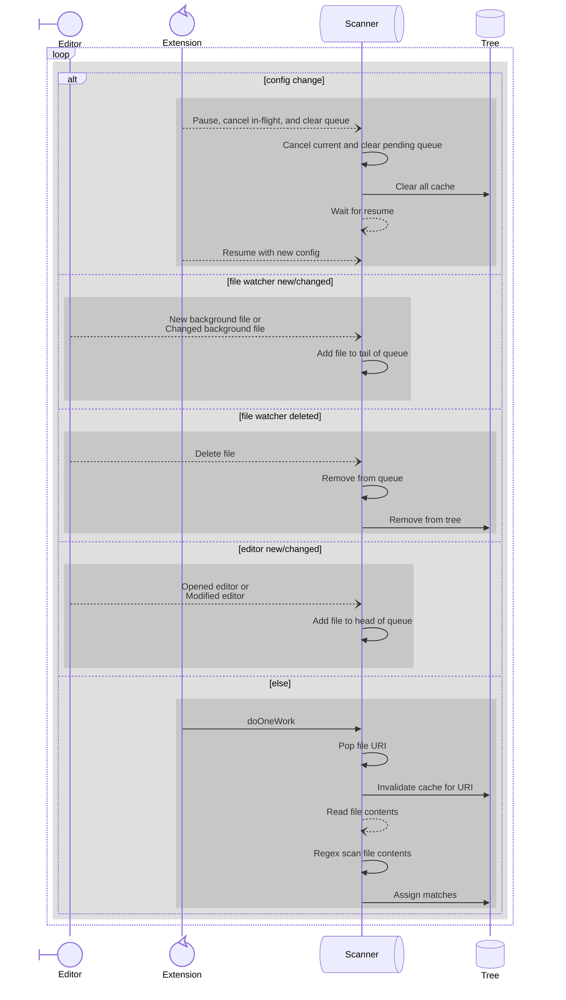
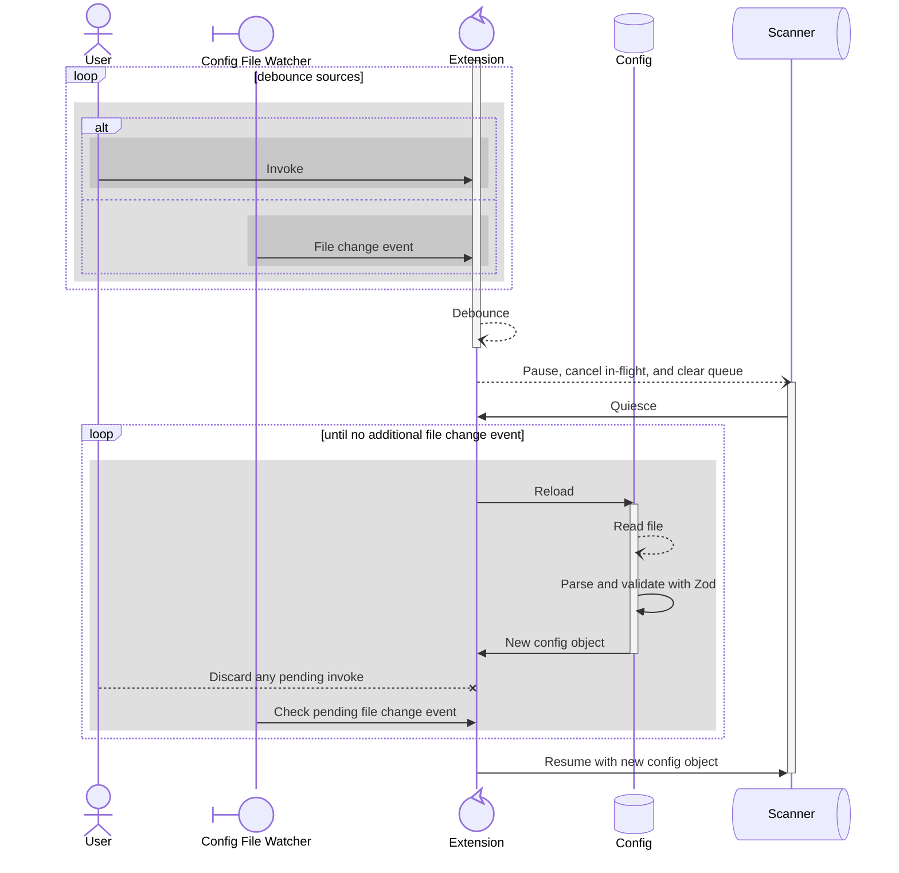

<!-- https://mermaid.js.org/syntax/sequenceDiagram.html -->

# Normal process

- **Editor:** event source from opening and closing files
- **Extension:** process orchestrator
- **Scanner:** background/async task queue that operates on a prebuilt config object
- **Tree:** the data storage and cache

# Config update

- **User:** event source from command palette, hotkey, UI button, etc
- **Config File Watcher:** event source from create/change/delete config file path
- **Extension:** process orchestrator
- **Config:** the data storage and schema
- **Scanner:** background/async task queue that operates on a prebuilt config object

